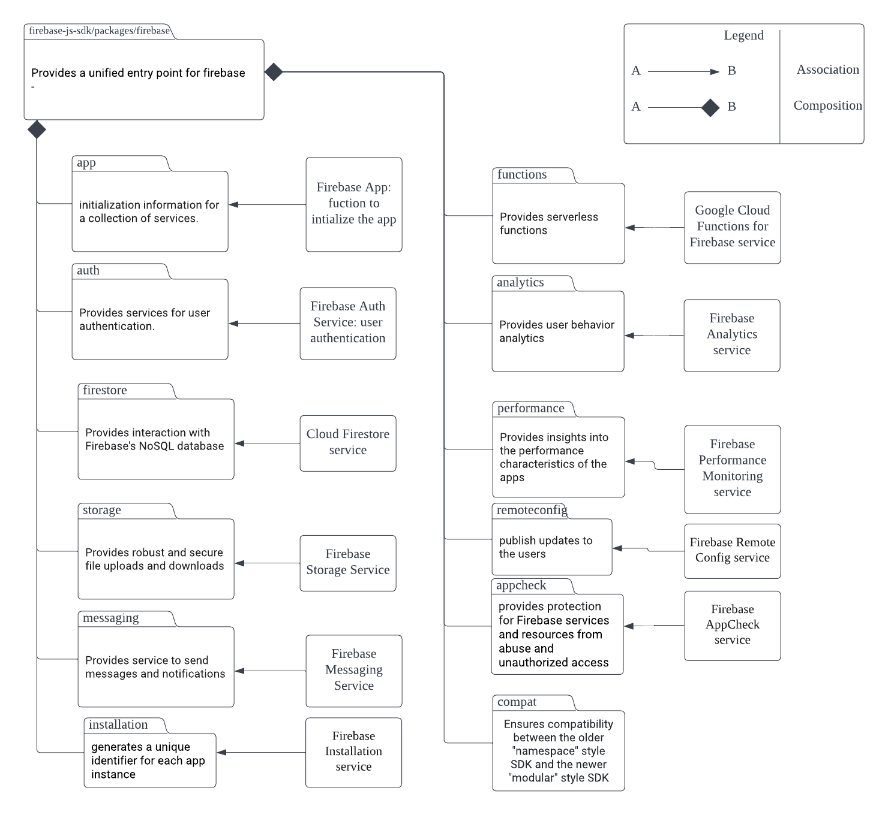

# Firebase JavaScript SDK

The system we're analyzing is Firebase, a backend platform created by Google. It gives developers essential real-time features such as authentication, databases and intergration for a variety of applications. Firebase also offers serverless cloud functions that allow developers to run code in response to events without worrying about the infrastructure of the code. This helps developers by simplifying app development to use ready-made and scalable backend services such that they can focus on other aspects such as UIs.

Firebase was created by James Tamplin and Andrew Lee by 2011. Currently of right now Firebase is maintains by Google and hosted via Google Cloud Platform. It seems that the person who's currently maintains it is the user github bhparijat.

---
## Project Overview
Firebase JavaScript SDK, is a powerful tool that is used for developing web and mobile applications across various users. From a user/consumer perspective, the Firebase JavaScript SDK provides APIs that facilitate various features such as authentication, database management, analytics, and more, simplifying the process of building robust and scalable applications.

The Firebase JavaScript SDK was initially created by Firebase, a start-up that was later acquired by Google in 2014. Since its acquisition, Firebase and its SDKs, including the JavaScript SDK, have been maintained and improved by Google.  As this is an open source repository, contribution could be made by anybody. However, due to being open source, all submissions that are made, even those that are members of project require review.

For further information about Firebase JavaScript SDK, the primary resource is its GitHub repository: https://github.com/firebase/firebase-js-sdk. The repository provides access to the SDK's source code, contributing guidelines, and ongoing development activity. Additionally, comprehensive official documentation on how to use Firebase and its JavaScript SDK is available on Google's Firebase website: https://firebase.google.com/docs/web/setup.

---
## Development View
### Component Diagram
| |
|:--:|
| _Figure 1: UML Component Diagram_|

| Component | Description |
|---|---|
| `api.ts` | Contains the main functions for initializing and managing Firebase apps. |
| `firebaseApp.ts` | Defines the FirebaseAppImpl class which represents a Firebase app instance. |
| `constants.ts` | Contains constant values used in other components. |
| `errors.ts` | Handles errors that occur within the Firebase app. |
| `logger.ts` | Handles logging for the Firebase app. |
| `platformLoggerService.ts` | Implements the logging service for the Firebase platform. |
| `public-types.ts` | Defines public types used in other components. |
| `registerCoreComponents.ts` | Handles the registration of core components in the Firebase app. |
| `types.ts` | Defines additional types used in other components. |
| `heartbeatService.ts` | Implements the service for sending periodic heartbeats. |
| `index.ts` | Entry point for the module. |
| `indexeddb.ts` | Contains functions for working with IndexedDB. |
| `internal.ts` | Contains internal functions for the Firebase app. |

### Dependencies
- The Firebase SDK has strong interdependencies, with Firebase App being the primary dependency for all other components. Each component can be used individually (except for Firebase App, which is necessary for initializing the platform), but many are designed to work together.

### High-level Codeline Model:
- Firebase JavaScript SDK follows a modular design. Each feature or service of Firebase has its own separate module. This design makes it possible for developers to import and use only the features they need, thus potentially reducing the size of their JavaScript bundles. The main codeline for the Firebase JavaScript SDK is hosted on GitHub and is open-source.

### Testing and Configuration
- The SDK uses various tools for testing such as Mocha, Chai, and Sinon. 
- ESLint and Prettier are used for linting and formatting.
- Rollup is used for bundling the JavaScript code.
- The configuration for it can be found in the `tsconfig.json`, `rollup.config.js` file.

All the files with a `.test.ts` extension are test files for the corresponding TypeScript modules. These are used to ensure the correctness of the code in the respective modules. Before running the app, you need `node` version between `10.15.0` and `16.6.0`, and `yarn` version should be between `1.0.0` and `1.22.11`. After, you should install dependencies by running `$ yarn` and build by `yarn build`. Afterward, you may run Automated tests. Automated tests are run using the `yarn test` command at the root level. Running `yarn run lint` works for testing code linting.

As for configuration, Firebase provides a variety of options that can be passed during the initialization of the Firebase app. These include Firebase project settings like API key, auth domain, database URL, project ID, storage bucket, and messaging sender ID.

---
## Applied Perspective

Our applied perspective that we focus around is Evolution. We focus on this perspective of Evolution as it considers modifiability to include changes easily in future versions this can be long living and be used in multiple systems. The desired qualities of this perspective are ensuring the system is flexible in case of an unforeseeable change after the entire system experiences deployment.

### Dimension of Change:

Firebase can be used in many different supportive system architectures, and there are many different types of risk that can be involved and associated with it. Thus the ability to identify the dimensions of change required can narrow the problem to be tractable. There are many different dimensions of changes, but for this particular system, these felt the most important.

> **Growth:**
        With how huge and the continued growth of Firebase is being used, it’s important to take into consideration of the increased number of users to take into consideration of a large amount of data.

> **Integration:**
        With Firebase being a huge backend containing data, it’s important that it can be integrated with numerous amount of other systems to be used. This is used in grabbing data from Firebase on a realtime database or user data for application to process.

**Reliability of Change:**

With many applications using Firebase, it’s important to ensure that system is continuing to keep working even after a small change. Thus including automated testing, stable development environments, and effective management is key to ensure that there isn’t a negative impact on a system.

### Applying the perspective

In documenting some aspect of the systems there were two approaches, **Characterize the Evolution Needs** and **Access the current ease of Evolution**.

**Characterize the Evolution Needs**

Accessing each type of evolution

| Functional Evolution|| 
|--|--|
|Type of change required:|Defect correction|
|Magnitude of change required:|Magnitude of 10|
|Likelihood of change score|15|
|Timescale of required changes:|Time Scale 1 month|

| Platform Evolution || 
|--|--|
|Type of change required:|Large Scale|
|Magnitude of change required:|Magnitude of 60|
|Likelihood of change score|5|
|Timescale of required changes:|Time Scale 12 months|

| Integration Evolution || 
|--|--|
|Type of change required:|Large Scale|
|Magnitude of change required:|Magnitude of 60|
|Likelihood of change score|5|
|Timescale of required changes:|Time Scale 12 months|
|Other Nodes| Open-ended requirements for integrating systems that need to be required.|

| Growth || 
|--|--|
|Type of change required:|Large Scale|
|Magnitude of change required:|Magnitude of 30|
|Likelihood of change score|10|
|Timescale of required changes:|Time Scale 3 months|

**Assess the current ease of Evolution**

Importance of Evolution:

> Most information systems need to be integrated with a number of other systems to be useful. This may involve retrieving information from systems on demand, processing the outputs of other systems, or providing information for other systems to process. As these other systems are created, evolve, and are removed, this may put evolution pressures on your system, so that although it does not have to change its functionality, it may need to change the way it integrates with other systems.

Potential Scenario:

> As the app gains popularity and user engagement increases, the development team realizes the need to enhance the app's functionality. To facilitate real-time collaboration among users, the team integrates Firebase Cloud Messaging (FCM) into the app. FCM enables sending push notifications to users' devices, allowing instant updates and notifications whenever there are new app updates, messages, or relevant events

Potential Step: In corresponding to Scenario 
> They decide to integrate Firebase Cloud Firestore, a NoSQL document database, to improve data querying and scalability. This integration allows them to easily store and retrieve complex data structures, perform advanced queries, and handle large datasets.

Questions based on Steps: 

How much will the system change?
- The system would change in integrating new features that notify users.

How difficult and risky is the result?
- The difficultly and risk of the project will result in being a somewhat considerate task. In taking into consideration of the risk is more inline of security. In ensuring there’s isn’t any information leak coming out.

---
## Identify Styles & Patterns Used
High-level architectural styles that are identified in the Firebase Javascript SDK is the client-server and event-based architectural styles, while design patterns used within the codebase are the adapter and facade pattern.

### Architectural Styles
**Client-server**: The client-server architecture is a style that consists of the system being divided into main components: the client and the server. In this style, the client represents the user interface or the front-end component that interacts with the users, and is responsible for presenting information to the user, handling user input as well as server requests. The server represents the back-end components and focuses on processing requests from the client and managing data. In addition to these components, client-server architecture also includes connectors and constraints. 

There are different areas where it is evident that the client-server architecture style is being applied within the Firebase Javascript SDK. One instance can be observed with the Realtime Database and the Cloud Firestore database which both follow a client-server model. When either the Realtime Database or the Cloud Firestore have a set of initial security rules selected, these permission settings are overwritten in the storage. 
The Firebase Authentication is also another key example of client-server architecture as it handles user input for the sake of user authentication and authorization. Clients interact with the Firebase Authentication by performing various sign-in actions. The client-side code communicates with the server-side infrastructure to verify user credentials and perform authentication.

**Event-based**: The event-based style is one where components within the system generate events which represent major occurrences or changes in the system. These events can include user actions, system events, or any other information that would be interpreted as notifications. The event-based style promotes scalability since components can be added or removed without affecting the overall system. This style is suitable for systems that require real-time processing and the handling of complex event flows which are characteristics of the Firebase Javascript SDK. 

An example of the usage of event-based architecture within the Firebase Javascript SDK is the Realtime Database and the Cloud Firestore which are real-time NoSQL databases provided by Firebase. These databases utilize event-based architecture as changes in the data trigger events that propagate to connected clients in real-time. For example, clients can subscribe to specific events such as someone adding or removing events and also receive updates for whenever their subscribed data is changed. This is event-driven in the form of immediate data updates and data synchronization. 

### Design Patterns
**Adapter Pattern**: The adapter pattern is one design pattern that is used within the Firebase Javascript SDK. Adapter patterns allow classes that usually would be incompatible to work together. It does this by converting the interface of a class into an interface that the client expects. The Firebase Javascript SDK uses the adapter pattern to provide a consistent interface for accessing Firebase services. It essentially acts as an adapter between the Firebase services and the client-side Javascript code. The SDK provides adapter classes that wrap around the native database APIs, and allows the client-side Javascript code to interact with the databases. These specific adapters handle the conversion of data and requests between the Firebase service and the client-side code. 

Another instance of when adapters are used is in the relationship between the Real-time Database and the Cloud Firestore and the Javascript SDK. The SDK provides adapter classes that wrap around the native database APIs similar to the aforementioned usage of adapters. However, these adapters handle tasks such as user-up, sign-in, token generations, and other tasks related to server-side infrastructure.

---
## Architectural Assessment
1. Single Responsibility Principle
The Single Responsibility Principle as one of the 5 SOLID design principles in software engineering refers to the idea that every function/class/module should be responsible to one, and only one, purpose. There should never be more than one reason for a class to change. Therefore, classes should be designed in such a way that every class serves a singular purpose. 

For one, within each module/class, there are functions with a single responsibility. There is a function called signInWithEmailAndPassword() that handles signing in with email and password with help from another internal Firebase package that signs in and takes various inputs. There are other functions such as signInWithEmailLink() that cover logging in with other information using that same package, but these functions are kept distinctly separate from the aforementioned signIn() using email and password. 

On a module level, each module is also divided into specific, different modules depending on which feature they cover. For example, it is divided into features such as firebase-firestore, firebase-functions, etc. The firebase-firestore will only handle operations (and nothing else) related to the database component of Firebase, such as storing and syncing data to the Cloud Firestore database provided. The firebase-functions handles only operations for event-driven activities. The Single Responsibility Principle is emphasized by the fact that firestore can be used to trigger functions, implying that they are maintained separate and singular in responsibility.

2. Open Closed Principle
The Open Closed Principle states that classes should be open for extension but closed for modification. Basically, classes should be developed such that it allows behavior to be extended without needing to alter its underlying source code. For example when adding new functionalities, new derived classes should be inherited from the original base class. 

In terms of this SDK, firebase-auth module provides various signin methods in auth.ts as mentioned in the section above: email and password, phone, Google, Facebook, etc. Each of these methods can extend the base authentication functionality from a higher level. The base authentication functionality can't (and shouldn't) be modified, but can be built upon by developers to include other auth providers for user credentials in signInWithCustom().

In firebase-firestore, it uses security rules to allow developers to control their database access. However, it has a flexible ruleset that can be extended to match external projects, such that developers can define how data is structured and when data can be read or written to. The actual Firestore's ruleset is closed for modification, but the flexible rules can be implemented directly through the Firebase CLI or through .rules files deployed to Firebase.

3. Dependency Inversion Principle
The Dependency Inversion Principle states that high-level modules should not depend on low level modules. Instead, both should depend on abstractions; details should depend on abstractions. This is because when a class knows about the design and implementation of another, it is likely that changes to a class will compromise the working capability of the other class. Therefore, it is best practice to loosely couple the high-level and low-level modules.

In the SDK, this principle can be seen when higher-level APIs interact with lower-level APIs through abstraction. For example, when initializing Firebase App Instances, each can be configured with different settings. At a code level, these can include things like API keys and project IDs. The high-level modules like firebase-auth and firebase-performance do not depend on a specific Firebase App instance. However, it is easy to customize your own instances as a developer by adding your own configs. Therefore, the system is more flexible as you can switch instances when initializing a service. 

In firebase-functions, this principle can also be seen in its service for storing/retrieving user data. For example, it implements an HttpCallable() function that is a Google Cloud trigger function that is triggered when an HTTP request is invoked. However, the method in which HTTP is invoked does not directly depend on what method is used to make network requests. Therefore, a developer does not need to worry about low-level network functionality when dealing with high-level storage functionality provided by Firebase.

4. Interface Segregation Principle
This principle states that clients should not be forced to depend on interfaces that they do not use. This principle therefore promotes the decoupling of modules and enhances readibility and maintainability.

The Firebase SDK is designed in a modular way, meaning that users can import and use only the specific services that are needed in their apps. For example, if the user only needs firebase-auth, they can only import that service and not the other components of the SDK like firebase-functions. This adheres to the ISP since the app is prevented from depending on other parts of the SDK that it does not use. The code below is an example.

`import firebase from 'firebase/app';
import 'firebase/auth';`

The SDK also has service-specific APIs. This means that each separate Firebase service has its own API that is specific to that functionality. For example, firebase-firestore has its own API for querying and managing data, while firebase-auth has its own API for logging in and out. This adheres to the ISP because each service has its own API that does not require another API in another functionality to work.

5. Liskov Substitution Principle
This principle states that "subtypes must be substitutable for their base types." This means that if software uses a base class, it should be able to use any of its subclasses without the program knowing, and without affecting correctness of the program.

The SDK conforms to the LSP indirectly, since JavaScript is not strictly object-oriented. It however does support prototypal inheritance. The SDK still makes use of the LSP through the way its APIs are structured. In firebase-firestore, there is a `DocumentSnapshot` class that has several basic methods like get(), set(), and update(). This has a subclass called `QueryDocumentSnapshot` that extends it; both have the same get() method. This is a direct example of LSP, since `QueryDocumentSnapshot` can be used anywhere `DocumentSnapshot` is expected to be used.

Another example in the SDK's Realtime Database is where it provides Reference and Query objects, which both have on() and off() and once() methods. Reference extends Query, such that all instances of References are also instances of Query and can be used wherever Query is expected. Most notably, you can pass in a Reference object to a function that expects a Query object without issues. This is a concrete example of the LSP.

---
## System Improvement

Changes Made| Why|
|--|--|
|Refactoring: Replace Magic Literal|In `packages/functions/src/service.ts`, there was hardcoded value of 70000, meaning 70s as timeout. However, without comment, there is no obvious meaning. Hence, This variable makes it hard to understand the purpose of the variable and shows the need to refactor for the code. The 70000 variable has been named as constant variable `DEFAULT_TIMEOUT_MS`, and replaced the magic variable in the code. 
|Refactoring: Extract Function|In `packages/auth/src/core/strategies/email_and_password.ts`, has the function `sendPasswordResetEmail()`. This function can be found as an long function of which making the function difficult to understand. Thus the function was extracted of putting parts of the functions that can go together. This results in making three new function `onCheckActionCode()`, `  awaitEmailPasswordReset()`, and `onCheckAuthentication()` in order to make the long function simple to understand.|
|Refactoring: Analytics Entry File|In `packages/analytics/src/index.ts`, the entry point for Analytics to register Analytics components with Firebase is long and not so readable. Though the code doesn't seem to have redundancies or overcomplications, I improved readibility and maintainability by separating the main component registration logic into another file, `componentRegistration.ts`. That way, the entry file remains simple and easy to follow, while core logic to setup the service with Firebase is handled in another file where it is easier to navigate and change. This, however, does not change logic/functionality. This also follows the Open-Closed Principle, as componentRegistration is now open for extension, but the entry point remains closed for modification.|
|--|--|