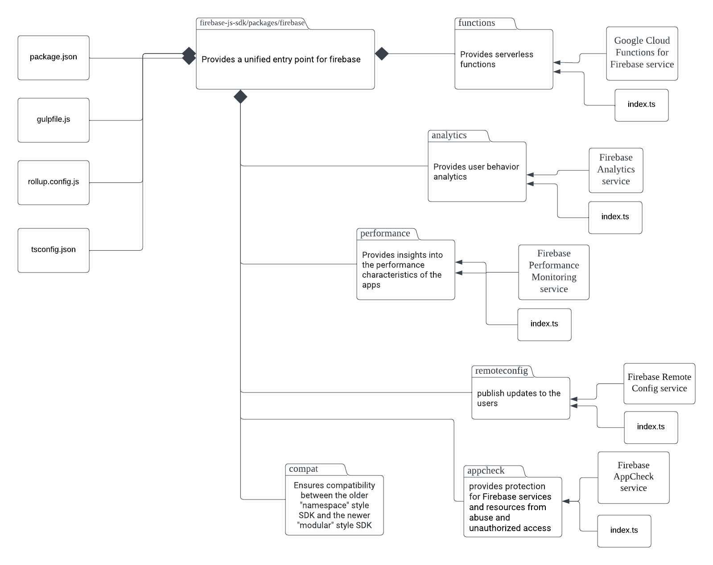

# Firebase JavaScript SDK

The system we're analyzing is Firebase, a backend platform created by Google. It gives developers essential real-time features such as authentication, databases and intergration for a variety of applications. Firebase also offers serverless cloud functions that allow developers to run code in response to events without worrying about the infrastructure of the code. This helps developers by simplifying app development to use ready-made and scalable backend services such that they can focus on other aspects such as UIs.

Firebase was created by James Tamplin and Andrew Lee by 2011. Currently of right now Firebase is maintains by Google and hosted via Google Cloud Platform. It seems that the person who's currently maintains it is the user github bhparijat.

---
## Project Overview
Firebase JavaScript SDK, is a powerful tool that is used for developing web and mobile applications across various users. From a user/consumer perspective, the Firebase JavaScript SDK provides APIs that facilitate various features such as authentication, database management, analytics, and more, simplifying the process of building robust and scalable applications.

The Firebase JavaScript SDK was initially created by Firebase, a start-up that was later acquired by Google in 2014. Since its acquisition, Firebase and its SDKs, including the JavaScript SDK, have been maintained and improved by Google.  As this is an open source repository, contribution could be made by anybody. However, due to being open source, all submissions that are made, even those that are members of project require review.

For further information about Firebase JavaScript SDK, the primary resource is its GitHub repository: https://github.com/firebase/firebase-js-sdk. The repository provides access to the SDK's source code, contributing guidelines, and ongoing development activity. Additionally, comprehensive official documentation on how to use Firebase and its JavaScript SDK is available on Google's Firebase website: https://firebase.google.com/docs/web/setup.

---
## Development View
### Component Diagram
| |
|:--:|
| _Figure 1: UML Component Diagram Part 1_|
| |
| _Figure 2: UML Component Diagram Part 2_|

| Component  | Description |
| ------------- |:-------------:|
| `index.ts`     | The entry point for the package. This entry point is defined in each file inside the `firebase` package, which imports and exports functionalities from all other Firebase SDKs. |
| `Firebase App`     | The core component that initializes the Firebase SDK and manages the application state. All other Firebase services are dependent on this component. The Firebase App initializes instances of all other components and services, providing a gateway to Firebase's functionality. |
| `index.cdn.ts`     | The entry point for the app. This acts similar to `index.ts` in app, but it provides component that is important for initialization through CDN(Content Delivery Network.) |
| `Firebase Auth`     | This component provides a full suite of services for user authentication. It supports various authentication methods, including email and password, phone numbers, and popular federated identity providers like Google and Facebook. |
| `cordova`     | This component provides a similar services as OAuth, but it provides full suite of services for user authentication in Cordova environment.|
| `react-native`     | This component provides a similar services as OAuth, but it provides full suite of services for user authentication in React-Native environment.|
| `Firebase Firestore`     | Cloud-hosted NoSQL database that enables the syncing of data across client apps in real-time. This ensures that the user's view of the data is always up-to-date, regardless of the network state. |
| `lite`     | Provides lightweight, standalone REST-only Firestore SDK that supports single document fetches, query execution, and document updates, at a fraction of the regular Web SDK size. |
| `Firebase Storage`     | Firebase Storage service provides robust, secure, and easy-to-use file uploads and downloads for Firebase apps. It's backed by Google Cloud Storage. |
| `Firebase Messaging`     | Provides services regarding deliver messages and notifications at no cost. It is used for sending notifications and messages to users across platforms — Android, iOS, and the web. |
| `sw`     |  Service Workers(sw) provides key component of Progressive Web Apps (PWAs), and handles push notifications and interacting with the Firebase Cloud Messaging (FCM) service.|
| `Firebase Functions`     | Provides serverless framework that lets you run your code in the cloud. May create functions that trigger on Firebase product events, HTTPS requests, or on a schedule . |
| `Firebase Analytics`     | Provides insights into app usage and user engagement. It enables you to understand how people use your iOS or Android app.|
| `Firebase Performance`     | Provides insights into the performance characteristics of your applications. It enables you to understand where and when the performance of your app can be improved so that you can use that information to fix performance issues. |
| `Firebase Remote Config`     | Provides cloud service that lets you change the behavior and appearance of your app without requiring users to download an app update. |
| `Firebase App Check`     | Works to protect your Firebase resources from abuse, such as billing fraud or phishing. It does this by asserting that incoming traffic is coming from your app, and blocking traffic that does not have a valid attestation. |
| `Firebase Compat`     | Ensures compatibility between the older "namespace" style SDK and the newer "modular" style SDK.  |
| `Firebase Installations`     | Provides service that generates a unique identifier for each app instance in your project. These identifiers are used by Firebase services to identify individual instances of your app |
| `package.json`      | Defines the package's metadata like its name, version, dependencies, scripts, etc. Also points to the main entry point file of the module.     |
| `gulpfile.js`      | A configuration file for the Gulp task runner.     |
| `rollup.config.js`     | Contains the configuration for Rollup, the module bundler used to bundle the Firebase JavaScript SDK.     |
| `tsconfig.json`     | File that configures the TypeScript compiler options and provide the necessary settings for compiling the TypeScript source code into JavaScript. |

### Dependencies
The Firebase SDK has strong interdependencies, with Firebase App being the primary dependency for all other components. Each component can be used individually (except for Firebase App, which is necessary for initializing the platform), but many are designed to work together.

### High-level Codeline Model:
- The Firebase JavaScript SDK follows a modular architecture, which organizes code into independent packages (modules) based on the functionality provided by each. Every module represents a Firebase service and is contained within its own directory. 

### Testing and Configuration
- The SDK uses various tools for testing such as Mocha, Chai, and Sinon. The tests can be found in the test directory in each service's directory.
- ESLint and Prettier are used for linting and formatting.
- Rollup is used for bundling the JavaScript code.
- The configuration for it can be found in the `tsconfig.json`, `rollup.config.js`, `gulpfile.js`file.

Tests are typically located in the `test` directory of each individual package. Automated tests are run using the `yarn test` command at the root level. Running `yarn run lint` works for testing code linting.

---
## Applied Perspective

Our applied perspective that we focus around is Evolution. We focus on this perspective of Evolution as it considers modifiability to include changes easily in future versions this can be long living and be used in multiple systems. The desired qualities of this perspective are ensuring the system is flexible in case of an unforeseeable change after the entire system experiences deployment.

### Dimension of Change:

Firebase can be used in many different supportive system architectures, and there are many different types of risk that can be involved and associated with it. Thus the ability to identify the dimensions of change required can narrow the problem to be tractable. There are many different dimensions of changes, but for this particular system, these felt the most important.

    Growth:
        With how huge and the continued growth of Firebase is being used, it’s important to take into consideration of the increased number of users to take into consideration of a large amount of data.

	Integration:
        With Firebase being a huge backend containing data, it’s important that it can be integrated with numerous amount of other systems to be used. This is used in grabbing data from Firebase on a realtime database or user data for application to process.

Reliability of Change:

With many applications using Firebase, it’s important to ensure that system is continuing to keep working even after a small change. Thus including automated testing, stable development environments, and effective management is key to ensure that there isn’t a negative impact on a system.

---
## Identify Styles & Patterns Used
High-level architectural styles that are identified in the Firebase Javascript SDK is the client-server and event-based architectural styles, while design patterns used within the codebase are the adapter and facade pattern.

### Architectural Styles
**Client-server**: The client-server architecture is a style that consists of the system being divided into main components: the client and the server. In this style, the client represents the user interface or the front-end component that interacts with the users, and is responsible for presenting information to the user, handling user input as well as server requests. The server represents the back-end components and focuses on processing requests from the client and managing data. In addition to these components, client-server architecture also includes connectors and constraints. 

There are different areas where it is evident that the client-server architecture style is being applied within the Firebase Javascript SDK. One instance can be observed with the Realtime Database and the Cloud Firestore database which both follow a client-server model. When either the Realtime Database or the Cloud Firestore have a set of initial security rules selected, these permission settings are overwritten in the storage. 
The Firebase Authentication is also another key example of client-server architecture as it handles user input for the sake of user authentication and authorization. Clients interact with the Firebase Authentication by performing various sign-in actions. The client-side code communicates with the server-side infrastructure to verify user credentials and perform authentication.

**Event-based**: The event-based style is one where components within the system generate events which represent major occurrences or changes in the system. These events can include user actions, system events, or any other information that would be interpreted as notifications. The event-based style promotes scalability since components can be added or removed without affecting the overall system. This style is suitable for systems that require real-time processing and the handling of complex event flows which are characteristics of the Firebase Javascript SDK. 

An example of the usage of event-based architecture within the Firebase Javascript SDK is the Realtime Database and the Cloud Firestore which are real-time NoSQL databases provided by Firebase. These databases utilize event-based architecture as changes in the data trigger events that propagate to connected clients in real-time. For example, clients can subscribe to specific events such as someone adding or removing events and also receive updates for whenever their subscribed data is changed. This is event-driven in the form of immediate data updates and data synchronization. 

### Design Patterns
**Adapter Pattern**: The adapter pattern is one design pattern that is used within the Firebase Javascript SDK. Adapter patterns allow classes that usually would be incompatible to work together. It does this by converting the interface of a class into an interface that the client expects. The Firebase Javascript SDK uses the adapter pattern to provide a consistent interface for accessing Firebase services. It essentially acts as an adapter between the Firebase services and the client-side Javascript code. The SDK provides adapter classes that wrap around the native database APIs, and allows the client-side Javascript code to interact with the databases. These specific adapters handle the conversion of data and requests between the Firebase service and the client-side code. 

Another instance of when adapters are used is in the relationship between the Real-time Database and the Cloud Firestore and the Javascript SDK. The SDK provides adapter classes that wrap around the native database APIs similar to the aforementioned usage of adapters. However, these adapters handle tasks such as user-up, sign-in, token generations, and other tasks related to server-side infrastructure.

---
## Architectural Assessment
1. Single Responsibility Principle
The Single Responsibility Principle as one of the 5 SOLID design principles in software engineering refers to the idea that every function/class/module should be responsible to one, and only one, purpose. There should never be more than one reason for a class to change. Therefore, classes should be designed in such a way that every class serves a singular purpose. 

For one, within each module/class, there are functions with a single responsibility. There is a function called signInWithEmailAndPassword() that handles signing in with email and password with help from another internal Firebase package that signs in and takes various inputs. There are other functions such as signInWithEmailLink() that cover logging in with other information using that same package, but these functions are kept distinctly separate from the aforementioned signIn() using email and password. 

On a module level, each module is also divided into specific, different modules depending on which feature they cover. For example, it is divided into features such as firebase-firestore, firebase-functions, etc. The firebase-firestore will only handle operations (and nothing else) related to the database component of Firebase, such as storing and syncing data to the Cloud Firestore database provided. The firebase-functions handles only operations for event-driven activities. The Single Responsibility Principle is emphasized by the fact that firestore can be used to trigger functions, implying that they are maintained separate and singular in responsibility.

2. Open Closed Principle
The Open Closed Principle states that classes should be open for extension but closed for modification. Basically, classes should be developed such that it allows behavior to be extended without needing to alter its underlying source code. For example when adding new functionalities, new derived classes should be inherited from the original base class. 

In terms of this SDK, firebase-auth module provides various signin methods in auth.ts as mentioned in the section above: email and password, phone, Google, Facebook, etc. Each of these methods can extend the base authentication functionality from a higher level. The base authentication functionality can't (and shouldn't) be modified, but can be built upon by developers to include other auth providers for user credentials in signInWithCustom().

In firebase-firestore, it uses security rules to allow developers to control their database access. However, it has a flexible ruleset that can be extended to match external projects, such that developers can define how data is structured and when data can be read or written to. The actual Firestore's ruleset is closed for modification, but the flexible rules can be implemented directly through the Firebase CLI or through .rules files deployed to Firebase.

3. Dependency Inversion Principle
The Dependency Inversion Principle states that high-level modules should not depend on low level modules. Instead, both should depend on abstractions; details should depend on abstractions. This is because when a class knows about the design and implementation of another, it is likely that changes to a class will compromise the working capability of the other class. Therefore, it is best practice to loosely couple the high-level and low-level modules.

In the SDK, this principle can be seen when higher-level APIs interact with lower-level APIs through abstraction. For example, when initializing Firebase App Instances, each can be configured with different settings. At a code level, these can include things like API keys and project IDs. The high-level modules like firebase-auth and firebase-performance do not depend on a specific Firebase App instance. However, it is easy to customize your own instances as a developer by adding your own configs. Therefore, the system is more flexible as you can switch instances when initializing a service. 

In firebase-functions, this principle can also be seen in its service for storing/retrieving user data. For example, it implements an HttpCallable() function that is a Google Cloud trigger function that is triggered when an HTTP request is invoked. However, the method in which HTTP is invoked does not directly depend on what method is used to make network requests. Therefore, a developer does not need to worry about low-level network functionality when dealing with high-level storage functionality provided by Firebase.

---
## System Improvement