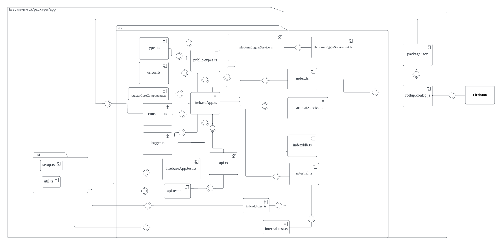

# Firebase JavaScript SDK

The system we're analyzing is Firebase, a backend platform created by Google. It gives developers essential real-time features such as authentication, databases and intergration for a variety of applications. Firebase also offers serverless cloud functions that allow developers to run code in response to events without worrying about the infrastructure of the code. This helps developers by simplifying app development to use ready-made and scalable backend services such that they can focus on other aspects such as UIs.

Firebase was created by James Tamplin and Andrew Lee by 2011. Currently of right now Firebase is maintains by Google and hosted via Google Cloud Platform. It seems that the person who's currently maintains it is the user github bhparijat.

## Project Overview

## Development View

### System Diagram

| Component  | Description |
| ------------- |:-------------:|
| `index.ts`     | The entry point for the package. This entry point is defined in each file inside the `firebase` package, which imports and exports functionalities from all other Firebase SDKs. |
| `Firebase App`     | This is the core component that initializes the Firebase SDK and manages the application state. All other Firebase services are dependent on this component. The Firebase App initializes instances of all other components and services, providing a gateway to Firebase's functionality. |
| `Firebase Auth`     | This component provides a full suite of services for user authentication. It supports various authentication methods, including email and password, phone numbers, and popular federated identity providers like Google and Facebook. |
| `Firebase Firestore`     | Cloud-hosted NoSQL database that enables the syncing of data across client apps in real-time. This ensures that the user's view of the data is always up-to-date, regardless of the network state. |
| `Firebase Storage`     | Firebase Storage service provides robust, secure, and easy-to-use file uploads and downloads for Firebase apps. It's backed by Google Cloud Storage. |
| `Firebase Messaging`     | Provides services regarding deliver messages and notifications at no cost. It is used for sending notifications and messages to users across platforms — Android, iOS, and the web. |
| `Firebase Functions`     | Provides serverless framework that lets you run your code in the cloud. May create functions that trigger on Firebase product events, HTTPS requests, or on a schedule . |
| `Firebase Analytics`     | Provides insights into app usage and user engagement. It enables you to understand how people use your iOS or Android app.|
| `Firebase Performance`     | Provides insights into the performance characteristics of your applications. It enables you to understand where and when the performance of your app can be improved so that you can use that information to fix performance issues. |
| `Firebase Remote Config`     | Provides cloud service that lets you change the behavior and appearance of your app without requiring users to download an app update. |
| `Firebase App Check`     | Works to protect your Firebase resources from abuse, such as billing fraud or phishing. It does this by asserting that incoming traffic is coming from your app, and blocking traffic that does not have a valid attestation. |
| `Firebase Compat`     | Ensures compatibility between the older "namespace" style SDK (firebase.<product>) and the newer "modular" style SDK (@firebase/<product>).  |
| `Firebase Installations`     | Provides service that generates a unique identifier for each app instance in your project. These identifiers are used by Firebase services to identify individual instances of your app |
| `package.json`      | Defines the package's metadata like its name, version, dependencies, scripts, etc. Also points to the main entry point file of the module.     |
| `rollup.config.js`     | Contains the configuration for Rollup, the module bundler used to bundle the Firebase JavaScript SDK.     |

### Dependencies
The Firebase SDK has strong interdependencies, with Firebase App being the primary dependency for all other components. Each component can be used individually (except for Firebase App, which is necessary for initializing the platform), but many are designed to work together.

### High-level Codeline Model:
- The Firebase JavaScript SDK follows a modular architecture, which organizes code into independent packages (modules) based on the functionality provided by each. Every module represents a Firebase service and is contained within its own directory. 

### Testing and Configuration
- The SDK uses various tools for testing such as Mocha, Chai, and Sinon. The tests can be found in the test directory in each service's directory.
- ESLint and Prettier are used for linting and formatting.
- Rollup is used for bundling the JavaScript code.
- The configuration for it can be found in the `tsconfig.json`, `rollup.config.js`, `rollup-internal.config.js`file.

Tests are typically located in the `test` directory of each individual package. Automated tests are run using the `yarn test` command at the root level. Running `yarn run lint` works for testing code linting.

